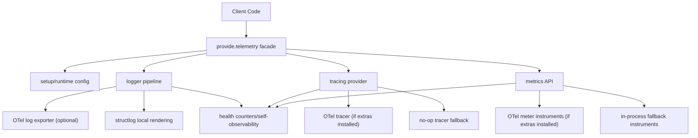
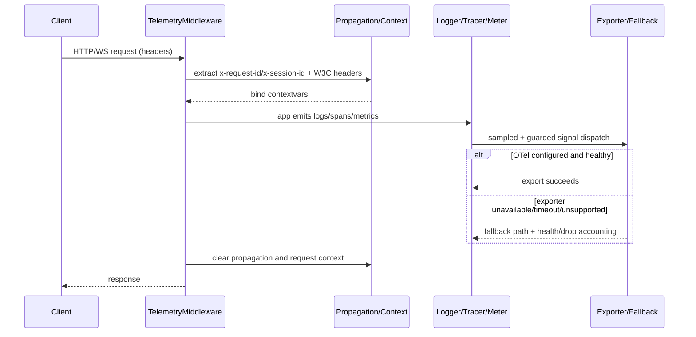
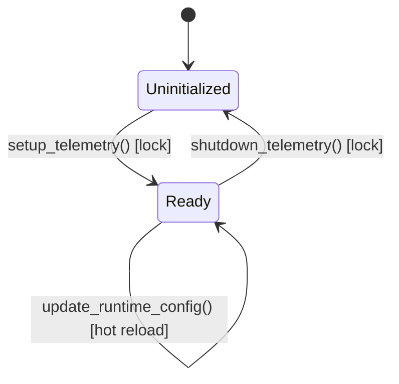
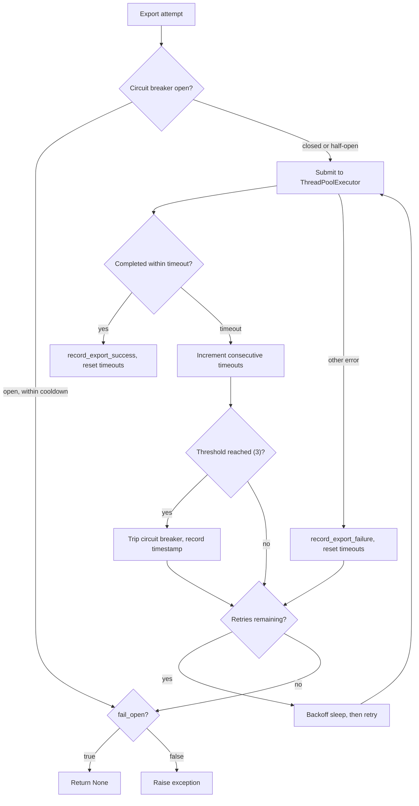

# Architecture

## Goals

- Unified telemetry facade for all provide.telemetry Python packages.
- Safe defaults with optional OpenTelemetry runtime integration.
- Strict event naming and schema validation for consistent analytics.
- Predictable behavior under async workloads.

## High-Level Layers

1. Public facade (`provide.telemetry`): stable imports and setup lifecycle.
2. Configuration (`TelemetryConfig`): env-driven, strongly typed runtime config.
3. Logging: structlog processors with contextvars-backed request/session propagation and optional OTLP log export.
4. Tracing: OTel provider if available, no-op tracer fallback otherwise.
5. Metrics: OTel meter provider if available, in-process fallback wrappers otherwise.
6. ASGI/WebSocket adapters: request context extraction and propagation.

## High-Level Component Flow

## Runtime Model

- One telemetry setup per process (`setup_telemetry`) guarded by a lock.
- Provider initialization is idempotent and lock-protected.
- `shutdown_telemetry` is serialized with `setup_telemetry` under the same lock to prevent setup/shutdown races.
- `shutdown_telemetry` marks setup state as not-ready before provider teardown.
- Runtime policy changes (`sampling`, `backpressure`, `exporter`) are hot-reloadable in-process.
- Provider-changing reconfiguration is constrained by OpenTelemetry's process-global providers; after real OTel providers are installed, those changes require process restart rather than in-process replacement.
- Runtime policy updates snapshot (`deepcopy`) the provided `TelemetryConfig` before storing/applying it.
- Runtime update/reload APIs return the applied runtime snapshot (not the caller-owned config object).
- All context propagation uses `contextvars` for async task safety.

## Async Safety

### Guaranteed

- Request context fields are isolated per task via `contextvars`.
- Trace context remains stable across await boundaries inside traced async callables.
- Setup and shutdown routines are race-safe for concurrent callers in the same process.

### Scope Limits

- State is process-local (multi-process workers each initialize their own providers).
- Export delivery guarantees depend on OTel exporters and backend availability.

## Failure and Fallback Strategy

- Missing OTel dependencies: tracing falls back to no-op tracer objects and metrics fall back to in-process wrappers.
- Invalid event names/required keys: deterministic schema errors.
- Export endpoint absent: tracing/metrics providers still initialize safely.

## Request Lifecycle Sequence

## Processor Pipeline

```mermaid
flowchart LR
    A["merge_contextvars"] --> B["merge_runtime_context"]
    B --> C["add_log_level"]
    C --> D{"include_timestamp?"}
    D -->|yes| E["TimeStamper"]
    D -->|no| F["harden_input"]
    E --> F
    F --> G["add_standard_fields"]
    G --> G2["add_error_fingerprint"]
    G2 --> H["apply_sampling"]
    H -->|DropEvent| X["discarded"]
    H --> I["enforce_event_schema"]
    I --> J["sanitize_sensitive_fields"]
    J --> J2{"module_levels?"}
    J2 -->|yes| J3["make_level_filter"]
    J2 -->|no| K{"include_caller?"}
    J3 --> K
    K -->|yes| L["CallsiteParameterAdder"]
    K -->|no| M["Renderer"]
    L --> M
    M --> N["console / json / pretty"]
```

## Setup and Shutdown State Machine

## Resilience Flow

## Subsystem Inventory

| Module | Responsibility |
|--------|---------------|
| `__init__.py` | Public API facade, 73 exports |
| `setup.py` | Lock-protected init/shutdown coordinator with rollback |
| `config.py` | Pydantic-free dataclass config, env var parsing |
| `runtime.py` | Hot-reload API, provider-change detection |
| `logger/core.py` | Structlog pipeline, handler construction, OTel log export |
| `logger/context.py` | Contextvars for request/session context |
| `logger/processors.py` | Processor chain: schema, sampling, PII, standard fields |
| `logger/pretty.py` | Pretty renderer with configurable colors |
| `tracing/provider.py` | OTel TracerProvider or no-op fallback |
| `tracing/context.py` | Contextvars for trace_id/span_id |
| `tracing/decorators.py` | `@trace` async decorator |
| `metrics/provider.py` | OTel MeterProvider or fallback |
| `metrics/api.py` | `counter()`, `gauge()`, `histogram()` constructors |
| `metrics/instruments.py` | Re-export shim for Counter/Gauge/Histogram (delegates to `fallback.py`) |
| `metrics/fallback.py` | In-process fallback Counter/Gauge/Histogram with sampling, backpressure, exemplar, and cardinality guard |
| `schema/events.py` | Event name validation, required-key enforcement |
| `sampling.py` | Per-signal probabilistic sampling with overrides |
| `backpressure.py` | Bounded queue ticket system |
| `resilience.py` | Retry, timeout, circuit breaker, ThreadPoolExecutor |
| `pii.py` | PII rule engine with nested traversal |
| `cardinality.py` | TTL-based attribute cardinality guards |
| `health.py` | Self-observability counters and snapshot |
| `propagation.py` | W3C traceparent/tracestate/baggage extraction |
| `slo.py` | RED/USE metric helpers |
| `exceptions.py` | TelemetryError, ConfigurationError |
| `asgi/middleware.py` | ASGI middleware for request context |
| `asgi/websocket.py` | WebSocket context helpers |

## Testing Strategy

- Unit tests with branch coverage for all local logic and fallback paths.
- Optional-extras tests to validate real OTel imports.
- Integration smoke test with local OTLP collector (manual/nightly CI).
- Full 3.11-3.14 quality matrix in CI.
