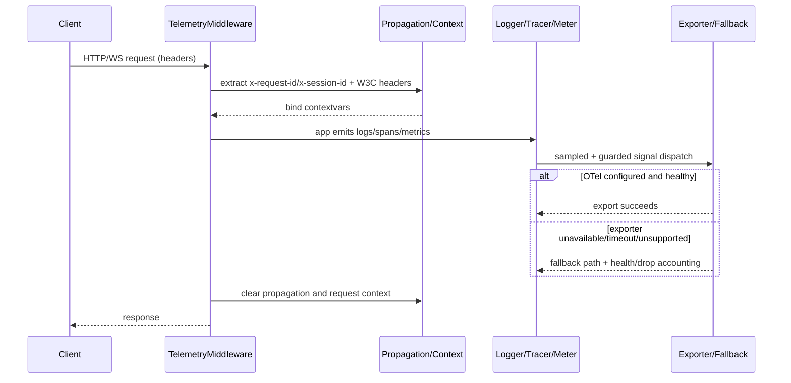

# Architecture

## Goals

- Unified telemetry facade for all Undef Python packages.
- Safe defaults with optional OpenTelemetry runtime integration.
- Strict event naming and schema validation for consistent analytics.
- Predictable behavior under async workloads.

## High-Level Layers

1. Public facade (`undef.telemetry`): stable imports and setup lifecycle.
2. Configuration (`TelemetryConfig`): env-driven, strongly typed runtime config.
3. Logging: structlog processors with contextvars-backed request/session propagation and optional OTLP log export.
4. Tracing: OTel provider if available, no-op tracer fallback otherwise.
5. Metrics: OTel meter provider if available, in-process fallback wrappers otherwise.
6. ASGI/WebSocket adapters: request context extraction and propagation.

## High-Level Component Flow

## Runtime Model

- One telemetry setup per process (`setup_telemetry`) guarded by a lock.
- Provider initialization is idempotent and lock-protected.
- `shutdown_telemetry` is serialized with `setup_telemetry` under the same lock to prevent setup/shutdown races.
- `shutdown_telemetry` marks setup state as not-ready before provider teardown.
- Runtime policy changes (`sampling`, `backpressure`, `exporter`) are hot-reloadable in-process.
- Provider-changing reconfiguration is constrained by OpenTelemetry's process-global providers; after real OTel providers are installed, those changes require process restart rather than in-process replacement.
- Runtime policy updates snapshot (`deepcopy`) the provided `TelemetryConfig` before storing/applying it.
- Runtime update/reload APIs return the applied runtime snapshot (not the caller-owned config object).
- All context propagation uses `contextvars` for async task safety.

## Async Safety

### Guaranteed

- Request context fields are isolated per task via `contextvars`.
- Trace context remains stable across await boundaries inside traced async callables.
- Setup and shutdown routines are race-safe for concurrent callers in the same process.

### Scope Limits

- State is process-local (multi-process workers each initialize their own providers).
- Export delivery guarantees depend on OTel exporters and backend availability.

## Failure and Fallback Strategy

- Missing OTel dependencies: tracing falls back to no-op tracer objects and metrics fall back to in-process wrappers.
- Invalid event names/required keys: deterministic schema errors.
- Export endpoint absent: tracing/metrics providers still initialize safely.

## Request Lifecycle Sequence

## Testing Strategy

- Unit tests with branch coverage for all local logic and fallback paths.
- Optional-extras tests to validate real OTel imports.
- Integration smoke test with local OTLP collector (manual/nightly CI).
- Full 3.11-3.14 quality matrix in CI.
