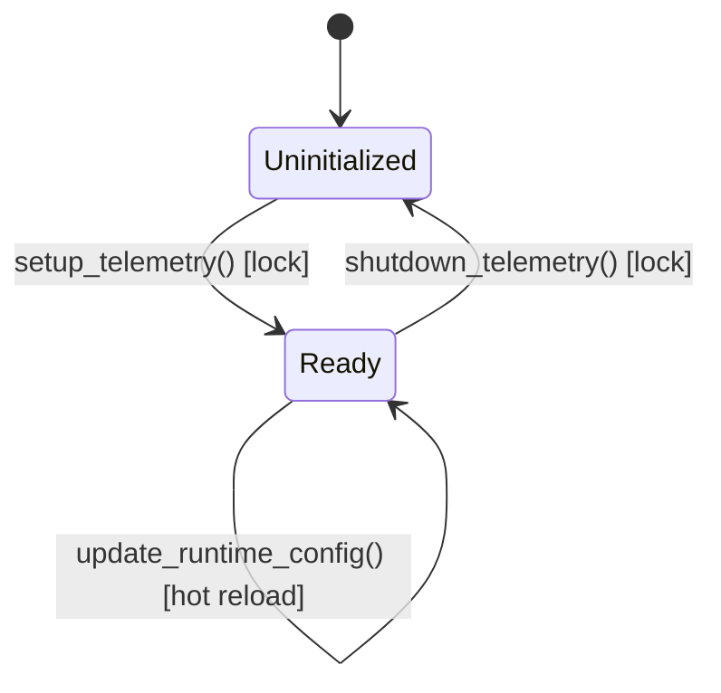
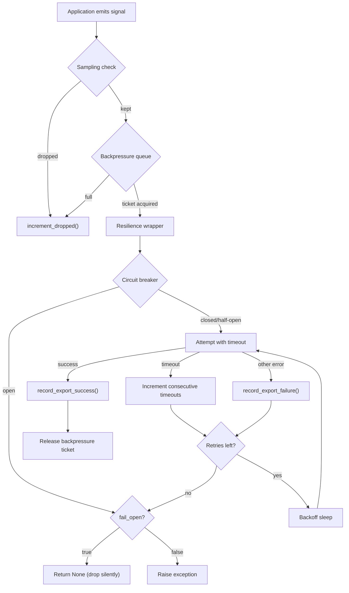
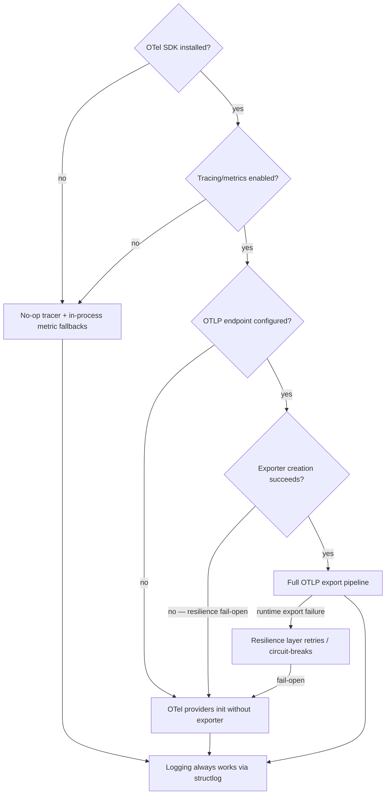

# Internals

How undef-telemetry works under the hood. For contributors and advanced users who need to understand the library's mechanics.

## Polyglot Note

The Python modules below remain the behavioral reference, but the repo now also carries a Rust crate under `rust/`. Rust preserves the same public API contracts while expressing context propagation through RAII guards rather than `contextvars` directly:

- `bind_context(...) -> ContextGuard`
- `bind_session_context(...) -> ContextGuard`
- `set_trace_context(...) -> ContextGuard`
- `bind_propagation_context(...) -> PropagationGuard`

Those guards restore the previous snapshot on `Drop`, which keeps nested binds and async task isolation predictable without requiring process-global mutable context.

## Polyglot Note

The Python modules below remain the behavioral reference, but the repo now also carries a Rust crate under `rust/`. Rust preserves the same public API contracts while expressing context propagation through RAII guards rather than `contextvars` directly:

- `bind_context(...) -> ContextGuard`
- `bind_session_context(...) -> ContextGuard`
- `set_trace_context(...) -> ContextGuard`
- `bind_propagation_context(...) -> PropagationGuard`

Those guards restore the previous snapshot on `Drop`, which keeps nested binds and async task isolation predictable without requiring process-global mutable context.

## Structlog Processor Pipeline

Every log event passes through a linear chain of structlog processors configured in `logger/core.py`. The chain runs in order — each processor transforms the event dict and returns it (or raises `DropEvent` to discard).

1. **`merge_contextvars`** — Pull all structlog contextvars bindings into the event dict.
2. **`merge_runtime_context`** — Merge logger context (request ID, session, etc.) and inject `trace_id`/`span_id` from tracing contextvars.
3. **`add_log_level`** — Stamp the log level string.
4. **`TimeStamper(fmt="iso")`** *(conditional: `include_timestamp=true`)* — Add ISO-8601 timestamp.
5. **`harden_input(max_attr_value_length, max_attr_count, max_nesting_depth)`** — Enforce security limits on attribute values, count, and nesting depth.
6. **`add_standard_fields(config)`** — Set `service`, `env`, `version` defaults. If `include_error_taxonomy` is enabled and `exc_name` is present, auto-classify the error via `classify_error()`.
7. **`add_error_fingerprint`** — Compute a 12-char hex fingerprint from exception type and normalized stack trace when `exc_info` is present.
8. **`apply_sampling`** — Probabilistic sampling check via `should_sample("logs", event)`. Raises `DropEvent` to discard below-rate events.
9. **`enforce_event_schema(config)`** — Validate event name format (3-5 dot-separated segments) and required keys. Raises `EventSchemaError` on violation.
10. **`sanitize_sensitive_fields(sanitize, max_nesting_depth)`** — Run PII rules then default sensitive-key redaction on the event dict.
11. **`make_level_filter(level, module_levels)`** *(conditional: when `module_levels` is configured)* — Per-module log level filtering, placed late so enrichment processors run first.
12. **`CallsiteParameterAdder`** *(conditional: `include_caller=true`)* — Add `filename` and `lineno` fields.
13. **Renderer** — One of: `ConsoleRenderer` (default), `JSONRenderer` (`fmt=json`), or `PrettyRenderer` (`fmt=pretty`).

## Setup and Shutdown Coordinator

`setup.py` orchestrates initialization through a lock-protected sequence:

### Initialization Sequence

1. Suppress OTel SDK export loggers (noise handled by resilience layer).
2. `apply_runtime_config(cfg)` — snapshot config, push sampling/backpressure/exporter policies.
3. `configure_logging(cfg, force=True)` — build structlog processor chain + handlers.
4. `_refresh_otel_tracing()` — detect if OTel tracing SDK is importable.
5. `_refresh_otel_metrics()` — detect if OTel metrics SDK is importable.
6. `setup_tracing(cfg)` — create `TracerProvider` with OTLP exporter if tracing is enabled and OTel is available; otherwise returns without action (no-op tracer is a runtime fallback in `get_tracer()`).
7. `setup_metrics(cfg)` — create `MeterProvider` with OTLP exporter if metrics are enabled and OTel is available; otherwise returns without action. The in-process fallback lives in the `counter()` / `gauge()` / `histogram()` wrappers.
8. `_rebind_slo_instruments()` — clear cached SLO counter/gauge/histogram so they rebind to new providers.

If any step after `configure_logging` fails, `_rollback()` tears down completed steps in reverse order.

### State Machine



The `_setup_done` flag and `_lock` mutex ensure:
- Concurrent `setup_telemetry()` calls are serialized; only the first performs work.
- `shutdown_telemetry()` clears `_setup_done` before tearing down providers, preventing races.
- After shutdown, package-local setup state is cleared. Reinstalling real OTel process-global providers still requires a full process restart.

## Signal Export Path



This flow applies to all three signals (logs, traces, metrics). Each signal has independent policies, circuit breaker state, and health counters.

## Resilience and Circuit Breaker

The resilience layer (`resilience.py`) wraps every export operation with retry, timeout, and circuit-breaking logic.

### Timeout Execution

Each signal (logs, traces, metrics) gets its own lazily-created `ThreadPoolExecutor(max_workers=2)`, isolating failure domains so a timeout storm in one signal cannot starve workers used by another. Export operations run with `future.result(timeout=...)`. On timeout, the future is cancelled (but already-running work continues on its daemon thread). When the circuit breaker trips (3 consecutive timeouts), the executor for that signal is replaced — the old pool is shut down (non-blocking) and a fresh pool is created for the next half-open probe.

### Circuit Breaker

- **Threshold**: 3 consecutive timeouts trip the breaker for a signal.
- **Cooldown**: 30 seconds. During cooldown, all attempts for that signal are short-circuited.
- **Half-open probe**: After cooldown expires, the next attempt is allowed through. Success resets the counter; failure re-trips.
- **Fail-open vs fail-closed**: When the breaker is open, `fail_open=true` (default) returns `None` silently; `fail_open=false` raises `TimeoutError`.

### Async Safety

When retries or backoff are configured and the code detects an active `asyncio` event loop:
- A `RuntimeWarning` is emitted (once per signal).
- Unless `allow_blocking_in_event_loop=true`, retries are forced to 1 and backoff to 0 (fail-fast).

## Graceful Degradation



Each signal degrades independently:
- **Tracing**: `TracerProvider` with OTLP exporter → `TracerProvider` without exporter → no-op tracer objects.
- **Metrics**: `MeterProvider` with OTLP exporter → `MeterProvider` without exporter → in-process `Counter`/`Gauge`/`Histogram` wrappers.
- **Logging**: Always functional via structlog. OTLP log export is additive — if the OTel logging handler fails to initialize, console/JSON output continues.

## PII and Cardinality Guards

### PII Engine

The PII engine (`pii.py`) processes log payloads in two passes:

1. **Custom rules**: Each `PIIRule` specifies a `path` (tuple of key segments, with `"*"` as wildcard) and a `mode`:
   - `"drop"` — remove the value entirely
   - `"redact"` — replace with `"***"`
   - `"hash"` — replace with first 12 chars of SHA-256 hex digest
   - `"truncate"` — keep first N characters, append `"..."`

2. **Default sensitive key redaction**: Keys matching `{"password", "token", "authorization", "api_key", "secret"}` (case-insensitive) are redacted with `"***"` unless a custom rule already targeted them.

Both passes traverse nested dicts and lists recursively.

### Cardinality Guards

The cardinality module (`cardinality.py`) prevents attribute explosion in metrics:

- `register_cardinality_limit(key, max_values, ttl_seconds)` sets a cap on distinct values per attribute key.
- `guard_attributes(attributes)` checks each key against its limit. Values beyond `max_values` are replaced with `"__overflow__"`.
- Expired values (older than `ttl_seconds`, using `time.monotonic()`) are pruned on each guard call.

## Health Self-Observability

`health.py` maintains per-signal counters behind a single `threading.Lock`:

- **Queue depth**: current backpressure queue occupancy.
- **Dropped**: events rejected by sampling or full queues.
- **Retries**: exporter retry attempts.
- **Async blocking risk**: calls where retry/backoff config was active inside an event loop.
- **Export failures**: failed export attempts with last error message.
- **Export latency**: last successful export round-trip in milliseconds.
- **Last success**: epoch timestamp of the most recent successful export.
- **Exemplar unsupported**: attempts to attach exemplars on instruments that don't support them.

Call `get_health_snapshot()` for a point-in-time frozen dataclass of all counters.

## Runtime Hot-Reload

### Hot-reloadable (no restart needed)

- Sampling policies (per-signal rates and overrides)
- Backpressure queue limits
- Exporter resilience policies (retries, backoff, timeout, fail-open)

These are applied via `update_runtime_config()` or `reload_runtime_from_env()`.

### NOT hot-reloadable (requires process restart)

- Log handlers and structlog processor chain
- OTel `TracerProvider` / `MeterProvider` (process-global singletons in the OTel SDK)
- Service name, environment, version

`reconfigure_telemetry()` detects whether the config change affects providers. If so and providers are already installed, it raises `RuntimeError` rather than silently producing inconsistent state.

## Rust Verification

The Rust implementation is considered healthy when these commands pass:

```bash
cd rust
cargo fmt --check
cargo clippy --all-targets --all-features -- -D warnings
cargo test
cargo test --features otel
cargo build --examples --features otel
uv run python spec/validate_conformance.py --lang rust
uv run python scripts/check_version_sync.py
uv run pytest -o addopts= e2e/test_cross_language_trace_e2e.py -q --no-cov
```
