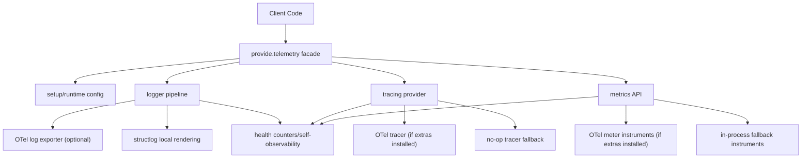
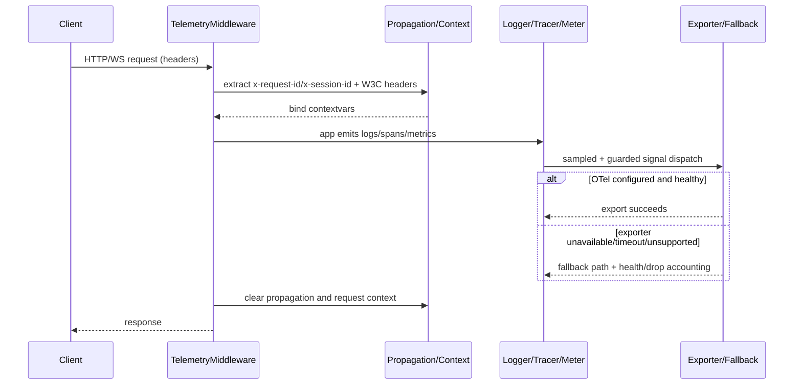
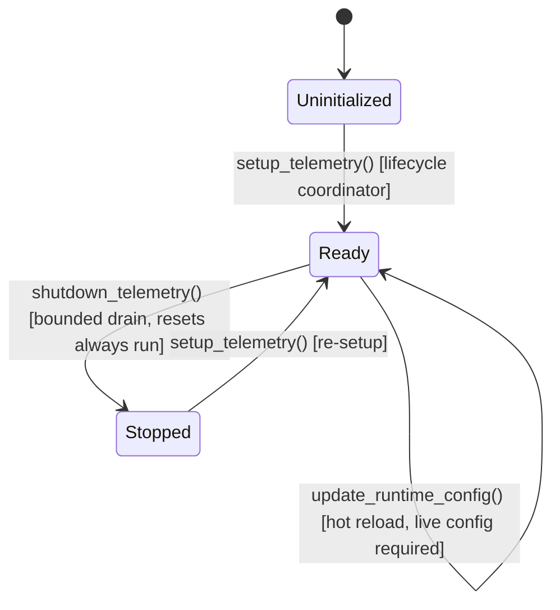
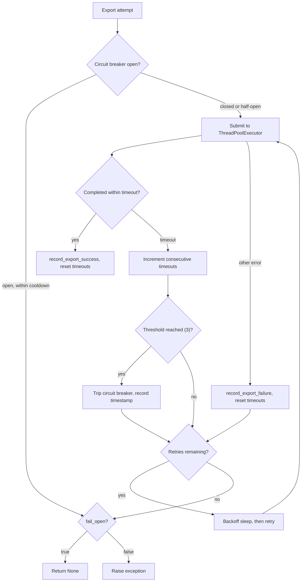

# Architecture

## Goals

- Unified telemetry facade across the repo's Python, TypeScript, Go, Rust, and C# implementations.
- Safe defaults with optional OpenTelemetry runtime integration.
- Strict event naming and schema validation for consistent analytics.
- Predictable behavior under async workloads.

## High-Level Layers

1. Public facade (`provide.telemetry`): stable imports and setup lifecycle.
2. Configuration (`TelemetryConfig`): env-driven, strongly typed runtime config.
3. Logging: structlog processors with contextvars-backed request/session propagation and optional OTLP log export.
4. Tracing: OTel provider if available, no-op tracer fallback otherwise.
5. Metrics: OTel meter provider if available, in-process fallback wrappers otherwise.
6. ASGI/WebSocket adapters: request context extraction and propagation.
7. Rust crate (`rust/`): guard-based context API, fallback facades, and optional `otel` feature wiring.

## High-Level Component Flow

## Runtime Model

- One telemetry setup per process (`setup_telemetry`) guarded by a lock.
- Provider initialization is idempotent and lock-protected.
- `shutdown_telemetry` is serialized with `setup_telemetry` under the same lock to prevent setup/shutdown races.
- `shutdown_telemetry` marks setup state as not-ready before provider teardown.
- Runtime policy changes (`sampling`, `backpressure`, `exporter`) are hot-reloadable in-process.
- Provider-changing reconfiguration is constrained by OpenTelemetry's process-global providers; after real OTel providers are installed, those changes require process restart rather than in-process replacement.
- Runtime policy updates snapshot runtime state before storing/applying it.
- Active runtime state is read back via `get_runtime_config()` / `GetRuntimeConfig()` / `getRuntimeConfig()` rather than by mutating a caller-owned config object.
- Python uses `contextvars` for async task safety; Rust preserves the same behavior with scoped guards over task-local/thread-local snapshots.

## Async Safety

### Guaranteed

- Request context fields are isolated per task via `contextvars`.
- Trace context remains stable across await boundaries inside traced async callables.
- Setup and shutdown routines are race-safe for concurrent callers in the same process.
- Rust guard-based context bindings restore prior request/session/trace state on `Drop`.

### Scope Limits

- State is process-local (multi-process workers each initialize their own providers).
- Export delivery guarantees depend on OTel exporters and backend availability.

## Failure and Fallback Strategy

- Missing OTel dependencies: tracing falls back to no-op tracer objects and metrics fall back to in-process wrappers.
- Invalid event names/required keys: deterministic schema errors.
- Export endpoint absent: tracing/metrics providers still initialize safely.

## Request Lifecycle Sequence

## Processor Pipeline

```mermaid
flowchart LR
    A["merge_contextvars"] --> A2["merge_runtime_context"]
    A2 --> B["inject_logger_name"]
    B --> B2["inject_das_fields"]
    B2 --> C["add_log_level"]
    C --> D{"include_timestamp?"}
    D -->|yes| E["TimeStamper"]
    D -->|no| F["harden_input"]
    E --> F
    F --> G["add_standard_fields"]
    G --> G2["add_error_fingerprint"]
    G2 --> H["enforce_event_schema"]
    H --> H2{"module_levels?"}
    H2 -->|yes| H3["make_level_filter"]
    H2 -->|no| I["apply_sampling"]
    H3 -->|DropEvent| X["discarded"]
    H3 --> I
    I -->|DropEvent| X
    I --> J["sanitize_sensitive_fields"]
    J --> K{"include_caller?"}
    K -->|yes| L["CallsiteParameterAdder"]
    K -->|no| M{"fmt == json?"}
    L --> M
    M -->|yes| M2["rename_event_to_message"]
    M -->|no| N["render_with_backpressure_extra"]
    M2 --> N
    N --> O["console / json / pretty"]
```

## Setup and Shutdown State Machine

The `RuntimeState` enum carries the seven-state vocabulary shared with Go,
Rust, TypeScript and C# (`local` / `starting` / `ready` / `degraded` /
`reconfiguring` / `stopping` / `stopped`); Python's runtime reports `ready`
and `stopped` and reserves the rest for parity with runtimes that surface
intermediate states.

## Resilience Flow

## Subsystem Inventory

| Module | Responsibility |
|--------|---------------|
| `__init__.py` | Public API facade, 108 exports (declarations only) |
| `_lazy.py` | PEP 562 symbol registry the facade resolves through |
| `setup.py` | Lock-protected init/shutdown coordinator with rollback |
| `config.py` | Pydantic-free dataclass config, env var parsing |
| `_config_validation.py` | Env-parsing validation helpers for `config.py` |
| `runtime.py` | Hot-reload API, provider-change detection, `TelemetryRuntime` |
| `_lifecycle.py` | Lifecycle coordinator publishing immutable runtime generations |
| `_runtime_types.py` | `RuntimeState` / `FlushResult` / `ReconfigureResult` shared shapes |
| `_runtime_policies.py` | Applies sampling/backpressure/exporter policy blocks |
| `_provider_drain.py` | Per-signal provider drain with honest per-signal outcomes |
| `_endpoint.py` | OTLP endpoint validation and credential masking |
| `_masking.py` | Masks OTLP credentials in config representations |
| `_resource.py` | OTel resource precedence ladder (default < `OTEL_*` env < config) |
| `_otel.py` | Lazy OTel import helpers, W3C context attach/inject |
| `logger/core.py` | Structlog pipeline, handler construction |
| `logger/handlers.py` | Stdlib logging handlers used by the structlog pipeline |
| `logger/_otel_logs.py` | Stateless OTel log-provider wiring |
| `logger/context.py` | Contextvars for request/session context |
| `logger/processors.py` | Processor chain: schema, sampling, PII, standard fields |
| `logger/pretty.py` | Pretty renderer with configurable colors |
| `tracing/provider.py` | OTel TracerProvider or no-op fallback |
| `tracing/context.py` | Contextvars for trace_id/span_id |
| `tracing/context_runtime.py` | Cross-context-safe OTel attach/detach (avoids `Token.reset()` raising across contexts) |
| `tracing/decorators.py` | `@trace` async decorator |
| `tracing/span.py` | Sync block-level `span()` context manager and span attribute helpers |
| `metrics/provider.py` | OTel MeterProvider or fallback |
| `metrics/api.py` | `counter()`, `gauge()`, `histogram()` constructors |
| `metrics/instruments.py` | Re-export shim for Counter/Gauge/Histogram (delegates to `fallback.py`) |
| `metrics/fallback.py` | In-process fallback Counter/Gauge/Histogram with sampling, backpressure, exemplar, and cardinality guard |
| `classification.py` | Data classification engine with per-field sensitivity rules |
| `consent.py` | Consent-aware telemetry collection gate |
| `receipts.py` | Cryptographic redaction receipts for audit trails |
| `schema/events.py` | Event name validation, required-key enforcement |
| `sampling.py` | Per-signal probabilistic sampling with overrides |
| `backpressure.py` | Bounded queue ticket system |
| `resilience.py` | Retry, timeout, circuit breaker, ThreadPoolExecutor |
| `resilient_exporter.py` | Per-export resilience wrappers so every `export()` runs under the policy, not just exporter construction |
| `pii.py` | PII rule engine with span-scoped secret detection (built-in + custom patterns) and nested traversal |
| `_secret_patterns_generated.py` | Built-in secret patterns, generated from `spec/secret_patterns.yaml` — do not edit |
| `headers.py` | Shared, safe header extraction (`get_header`) |
| `cardinality.py` | TTL-based attribute cardinality guards |
| `health.py` | Self-observability counters and snapshot |
| `propagation.py` | W3C traceparent/tracestate/baggage extraction |
| `slo.py` | RED/USE metric helpers |
| `exceptions.py` | TelemetryError, ConfigurationError |
| `asgi/middleware.py` | ASGI middleware for request context |
| `asgi/websocket.py` | WebSocket context helpers |
| `testing.py` | pytest plugin for per-test telemetry isolation |

## Governance Modules

Governance is part of the mandatory API surface in all five languages:
`classification`, `consent`, and `receipts` are always linked and loaded by default.
`spec/validate_conformance.py` enforces this through `_GOVERNANCE_LANGUAGES`,
which lists Python, TypeScript, Go, Rust, and C#.
Core signal paths (logging, tracing, metrics, schema handling, health, resilience)
still execute when governance policies are permissive.

Governance symbols are marked `required: true` in `spec/telemetry-api.yaml`.

## Testing Strategy

- Unit tests with branch coverage for all local logic and fallback paths.
- Optional-extras tests to validate real OTel imports.
- Integration smoke test with local OTLP collector (manual/nightly CI).
- Python, TypeScript, Go, Rust, and C# each validate against the shared API spec; Rust additionally runs `cargo fmt`, `cargo clippy`, `cargo test`, and `cargo test --features otel`, and C# builds its solution with `-warnaserror`.
- Strip-governance verification artifacts were removed; this parity slice now validates governance always-on behavior.
